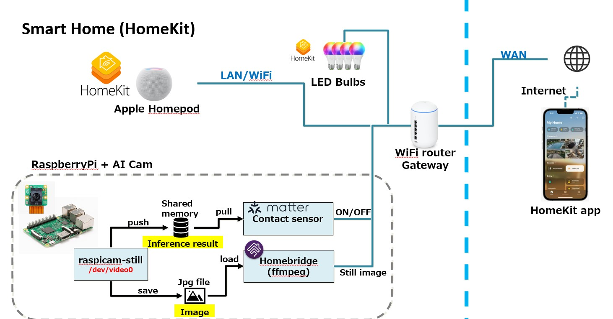

# RaspberryPi + AI Camera as a Matter device (HomeKit)

This document explains how to setup RaspberryPi as Matter contact sensor device with PI AI Camera.

## Block diagram



- Run ObjectDetection AI model by calling rpicam-apps. If human is detected, send ON(Closed) status to HomeKit and if no human, send OFF(Opened) status as a Matter contact sensor.
- It is also possible to control other HomeKit devices based on human presence status by automation feature in HomeKit app. (Not documented in this document)

## Tested environment

- raspberryPi 4B 4GB (Recommend 8GB)
- 64GB SD card
  - 32GB is too small. Required 64GB or more.
- RaspberryPi AI Cam
- RaspberryPi OS 64bit (Release 5.5, November 2024)
- Matter SDK v1.3.0.0
- rpicam-apps v1.5.3

## Change config.txt for RaspberryPi 4B (Skip it with RaspberryPi 5)

- Reference: https://forums.raspberrypi.com/viewtopic.php?t=378050

When booting RaspberryPi 4B board with connecting PI AI camera, RaspberryPi won't boot. Here is the steps for solve the issue.

1. Power off the RaspberryPi 4B board and remove PI AI camera from the board.
2. Power on the board.
3. Open config.txt file

    ```bash
    sudo vi /boot/firmware/config.txt
    ```

4. Find camera_auto_detect and comment out.

    ```bash
    #camera_auto_detect=1
    ```

5. Add this line at the bottom.

    ```bash
    dtoverlay=imx500
    ````

6. Power off the board and connect AI Camera.
7. Power in the board.

## Update imx500 firmware to V15

- Reference: https://forums.raspberrypi.com/viewtopic.php?t=378050

It seems that it is required to perform firmware update for detecting AI Cam. Perform these following steps.

1. Copy imx500_i2c_flash and main_v15.bin from https://drive.google.com/drive/folders/1aUWJt8y4i1wAmRtE28j1tbEOTYlS3gzJ?usp=drive_link

2. Flash firmware

    ```bash
    chmod +x ./imx500_i2c_flash
    ./imx500_i2c_flash main_v15.bin
    ```

3. Check imx500 is listed as an available camera

    ```bash
    rpicam-hello --list-cameras
    ```

4. Check output:

    ```bash
        Available cameras
        -----------------
        0 : imx500 [4056x3040 10-bit RGGB] (/base/soc/i2c0mux/i2c@1/imx500@1a)
            Modes: 'SRGGB10_CSI2P' : 2028x1520 [30.02 fps - (0, 0)/4056x3040 crop]
                                4056x3040 [10.00 fps - (0, 0)/4056x3040 crop]
    ```

## PI AI Cam setup

- Reference: https://www.raspberrypi.com/documentation/accessories/ai-camera.html

This is just for testing PI AI Camera working with pre-installed rpicam-apps. The pre-installed rpicam-apps will be deleted later. This step can be skipped.

1. Update

    ```bash
    sudo apt update && sudo apt full-upgrade
    ```

2. Install imx500 package

    ```bash
    sudo apt install -y imx500-all
    sudo reboot
    ```

3. Test raspicam

    ```bash
    rpicam-hello -t 0s --post-process-file /usr/share/rpi-camera-assets/imx500_mobilenet_ssd.json --viewfinder-width 1920 --viewfinder-height 1080 --framerate 30
    ```

## Setup rpicam-apps

Refer : [README.md](./rpicam-apps/README.md)

## Setup Matter contact sensor

Refer : [README.md](./connectedhomeip//README.md)
