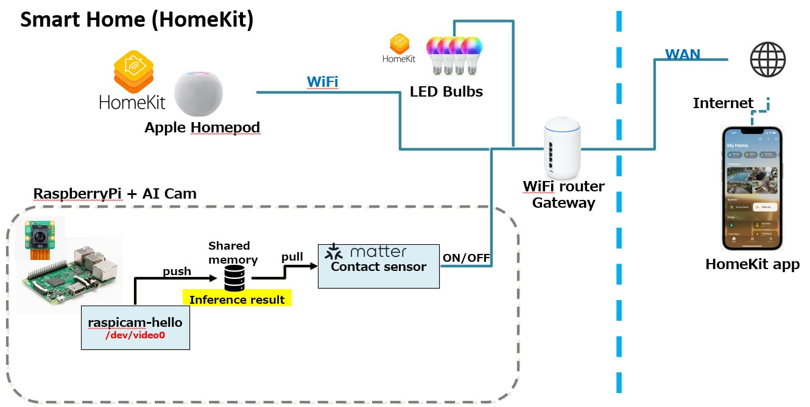

# RaspberryPi + AI Camera as a Matter device (HomeKit)

This document explains how to setup RaspberryPi as Matter contact sensor device with PI AI Camera.

Current status: No AI camera integrated. Only "psuedo" contact sensor works.

## Block diagram



## Tested environment

- raspberryPi 4B 4GB (Recommend 8GB)
- 64GB SD card
  - 32GB is too small. Required 64GB or more.
- RaspberryPi AI Cam
- RaspberryPi OS 64bit (latest)
- Matter SDK v1.3.0.0

## Update imx500 firmware to V15 for RaspberryPi 4B (Skip it with RaspberryPi 5)

- Reference: https://forums.raspberrypi.com/viewtopic.php?t=378050

It is requred to perform firmware update for detecting AI Cam for RaspberryPi 4B. Perform these seteps without connecting PI AI camera.

1. Open config.txt file

	```bash
	sudo vi /boot/firmware/config.txt
	```

2. Find camera_auto_detect and comment out.

	```bash
	#camera_auto_detect=1
	```

3. Add this line at the bottom.

	```bash
	dtoverlay=imx500
	````

4. Power off and connect AI Camera.

5. Copy imx500_i2c_flash and main_v15.bin from https://drive.google.com/drive/folders/1aUWJt8y4i1wAmRtE28j1tbEOTYlS3gzJ?usp=drive_link

6. Flash firmware

	```bash
	chmod +x ./imx500_i2c_flash
	./imx500_i2c_flash main_v15.bin
	```

7. Check imx500 is listed as an available camera

	```bash
	rpicam-hello --list-cameras
	```

8. Check output:

	```bash
		Available cameras
		-----------------
		0 : imx500 [4056x3040 10-bit RGGB] (/base/soc/i2c0mux/i2c@1/imx500@1a)
			Modes: 'SRGGB10_CSI2P' : 2028x1520 [30.02 fps - (0, 0)/4056x3040 crop]
								4056x3040 [10.00 fps - (0, 0)/4056x3040 crop]
	```

## PI AI Cam setup

- Reference: https://www.raspberrypi.com/documentation/accessories/ai-camera.html

1. Update

	```bash
	sudo apt update && sudo apt full-upgrade
	```

2. Install imx500 package

	```bash
	sudo apt install imx500-all
	sudo reboot
	```

3. Test raspicam

	```bash
	rpicam-hello -t 0s --post-process-file /usr/share/rpi-camera-assets/imx500_mobilenet_ssd.json --viewfinder-width 1920 --viewfinder-height 1080 --framerate 30
	```

## Increase swap

ninja command consume memory. Increase swap size from 512MB to 2GB.

1. Check current swap size and open ddphys-swapfile file.

	```bash
	free
	sudo dphys-swapfile swapoff
	sudo vi /etc/dphys-swapfile
	```

2. Modify swap size to 2GB.

	- Before modification : CONF_SWAPSIZE=512
	- After modification  : CONF_SWAPSIZE=2048

3. Apply change.

	```bash
	sudo dphys-swapfile setup
	sudo dphys-swapfile swapon
	free
	```

## Clone source

- Reference: https://github.com/project-chip/connectedhomeip/blob/v1.3.0.0/docs/guides/BUILDING.md

```bash
git clone --recurse-submodules https://github.com/project-chip/connectedhomeip.git -b v1.3.0.0
cd connectedhomeip
git submodule update --init
```

## Install devendencies

- Reference: https://github.com/project-chip/connectedhomeip/blob/v1.3.0.0/docs/guides/BUILDING.md

```bash
sudo apt-get install git gcc g++ pkg-config libssl-dev libdbus-1-dev \
     libglib2.0-dev libavahi-client-dev ninja-build python3-venv python3-dev \
     python3-pip unzip libgirepository1.0-dev libcairo2-dev libreadline-dev
```

## Apply patch for contact sensor

copy [new_file.patch](./patch/new_file.patch) and [diff.patch](./patch/diff.patch) to connectedhomeip and apply patch.

```bash
cd connectedhomeip
git apply new_file.patch
git apply diff.patch
```

## Environment setup

```bash
source ./scripts/bootstrap.sh
source ./scripts/activate.sh
```

The activate.sh is required for activating shell build environment when boot-up raspberrypi board.

## Build for contact sensor app

```bash
cd examples/contact-sensor-app/linux
gn gen out/debug
ninja -C out/debug -j3
```

## Run contact sensor app

Using wifi. (I haven't tried BLE because it require BLE-USB dongle)

```bash
./out/debug/contact-sensor-app --wifi
```

## HomeKit app

1. Open HomeKit app.
2. Click "+" on top right corner.
3. Select "Add Accessory"
4. Select "More options" if no Matter device is detected.
5. Set code "2020-2021"
6. If the process went through, device is registered as "Contact Sensor"
